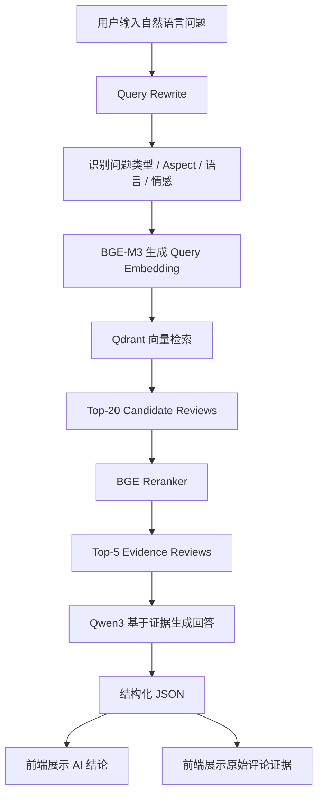
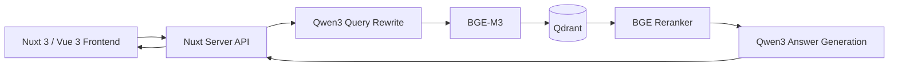

# AI 电商评论智能分析平台 产品需求文档（PRD）

> **文档版本**：v1.0  
> **文档状态**：Draft  
> **创建日期**：2026-08-23  
> **产品形态**：Web 应用 / AI 分析工具  
> **当前阶段**：可运行原型（Prototype）→ 产品化 MVP  
> **核心技术**：RAG、LLM、Embedding、Vector Database、Reranker  
> **支持语言**：中文 / 英文 / 西班牙语

---

## 1. 产品概述

### 1.1 产品名称

**AI 电商评论智能分析平台**（暂定名）

### 1.2 一句话产品定义

一个面向消费者、电商运营人员和数据分析人员的 **AI 评论分析平台**：用户可以直接用自然语言询问商品评论中的质量、价格、物流、耐用性、服务等问题，系统通过 RAG 从真实评论中检索证据，并基于这些证据生成可追溯的分析结果。

### 1.3 产品愿景

传统电商平台主要通过：

- 星级评分
- 评论列表
- 关键词搜索
- 简单的好评 / 差评统计

帮助用户理解商品口碑。

但这些方式存在明显问题：当评论达到数百甚至数千条时，用户无法高效阅读全部信息，也难以回答更具体的问题，例如：

- 这个产品最常见的问题是什么？
- 差评主要集中在质量还是物流？
- 用户觉得这个产品耐用吗？
- 有没有人反馈包装损坏？
- 用户觉得它值这个价格吗？
- 西班牙语差评里主要在抱怨什么？

本产品希望将大量非结构化评论转化为一个 **可对话、可检索、可验证的商品评论知识库**。

---

## 2. 背景与问题

### 2.1 用户现有行为

用户判断一个商品是否值得购买时，通常会：

1. 查看平均星级；
2. 阅读几条热门评论；
3. 专门筛选一星、二星差评；
4. 搜索关键词，例如“质量”“坏了”“物流”“电池”；
5. 在多个页面之间反复翻阅评论；
6. 根据少量样本自行形成判断。

这种方式在评论数量较少时可行，但在大量评论场景下效率很低。

### 2.2 核心痛点

| 痛点 | 具体表现 |
|---|---|
| 评论数量过多 | 用户无法在短时间内阅读数百、数千条评论 |
| 星级信息过于粗粒度 | 只能知道“满意/不满意”，不知道具体原因 |
| 关键词搜索能力有限 | “耐用性”可能以“用了两天就坏了”等方式表达 |
| 多语言评论难以统一分析 | 用户可能无法阅读英语、西班牙语或其他语言评论 |
| 普通 LLM 容易产生幻觉 | AI 可能给出听起来合理但评论中根本不存在的结论 |
| 分析过程不可追溯 | 用户无法确认 AI 的判断来自哪条真实评论 |

### 2.3 产品机会

通过 **Query Rewrite + 多语言 Embedding + 向量检索 + Rerank + LLM 生成 + Evidence Citation** 的方式，可以把评论列表升级为一个面向自然语言问题的分析系统。

产品不只告诉用户“结论是什么”，还必须告诉用户：

> **为什么得出这个结论，以及依据的是哪些真实评论。**

---

## 3. 产品目标

### 3.1 核心目标

#### G1：降低评论阅读成本

用户无需阅读大量评论，只需要提出问题即可获得评论总结。

#### G2：提供细粒度分析

系统能够围绕以下维度理解问题：

- Quality / 质量
- Price / 价格
- Shipping / 物流
- Durability / 耐用性
- Service / 售后服务
- General / 综合评价

#### G3：降低 AI 幻觉

AI 不允许脱离检索到的评论自由生成商品事实。

回答必须建立在已检索证据之上。

#### G4：保证结果可验证

每次分析结果均可展示对应的：

- Review ID
- 原始评论文本
- 评论语言
- 情感标签
- Evidence Quote

#### G5：支持多语言查询

用户可以使用：

- 中文
- English
- Español

提出问题，并获得对应语言的回答。

---

## 4. 非目标

MVP 阶段暂不解决以下问题：

- 不训练新的基础大语言模型；
- 不训练完整监督式 ABSA 模型；
- 不建设完整 Amazon 商业数据抓取平台；
- 不负责商品购买、支付、订单和物流；
- 不保证覆盖所有 Amazon 商品；
- 不把 LLM 自身知识作为商品事实来源；
- 不在缺乏证据时强行生成结论。

---

## 5. 目标用户

### 5.1 普通消费者

**核心诉求：**

快速判断商品是否值得购买。

**典型问题：**

- 这个产品容易坏吗？
- 用户对质量满意吗？
- 差评主要在抱怨什么？
- 包装有没有问题？
- 值不值这个价格？

---

### 5.2 电商运营 / 产品运营

**核心诉求：**

从大量评论中快速发现产品问题和用户反馈。

**典型问题：**

- 最近差评主要集中在哪些方面？
- 哪些质量问题被反复提到？
- 物流问题和产品质量问题哪个更多？
- 客服和售后反馈如何？

---

### 5.3 数据分析 / AI 研究人员

**核心诉求：**

观察 RAG 不同模块对检索和回答质量的影响。

**典型行为：**

- 调整 Top-K；
- 调整 Prompt；
- 更换 Embedding；
- 更换 Reranker；
- 对比 Direct LLM 与 RAG；
- 查看自动化评估指标。

---

## 6. 核心用户场景

### 场景 1：购买前快速了解商品

用户准备购买一个商品，但页面有大量评论。

用户输入：

> 这个产品最常见的质量问题是什么？

系统：

1. 识别问题属于 `quality`；
2. 重写查询；
3. 检索质量相关评论；
4. Rerank；
5. 生成总结；
6. 展示引用评论。

---

### 场景 2：专门分析差评

用户输入：

> 西班牙语差评主要在抱怨什么？

系统识别：

```json
{
  "language_filter": "es",
  "sentiment_filter": "negative"
}
```

之后仅在对应评论集合中搜索。

---

### 场景 3：分析隐含语义

用户输入：

> 这个产品耐用吗？

即使评论中没有出现“durability”，系统仍可检索：

- broke after two days
- too fragile
- stopped working
- fell apart
- cheap material

从而进行语义级分析，而非单纯关键词匹配。

---

### 场景 4：证据不足

用户输入一个当前数据集无法回答的问题。

系统不得编造答案。

返回：

> 当前评论中没有检索到足够的相关证据，暂时无法得出可靠结论。

---

## 7. 产品核心流程



---

## 8. AI Pipeline

### 8.1 Query Rewrite

用户的问题不直接进入向量数据库。

系统首先调用 LLM 对用户问题进行理解与重写。

#### 输入

```text
西班牙语差评里用户主要抱怨什么？
```

#### 输出示例

```json
{
  "rewritten_queries": [
    "negative Spanish Amazon reviews main complaints",
    "Spanish reviews mentioning product problems",
    "common complaints in negative Spanish customer reviews"
  ],
  "detected_aspect": "general",
  "question_type": "sentiment_query",
  "language_filter": "es",
  "sentiment_filter": "negative",
  "confidence": 0.91
}
```

### 8.2 Query Rewrite 规则

系统需要：

1. 保留用户原始意图；
2. 生成 2～3 条适合语义检索的 Query；
3. 判断 Aspect；
4. 判断 Question Type；
5. 判断 Language Filter；
6. 判断 Sentiment Filter；
7. 输出 Confidence；
8. 仅输出合法 JSON。

---

## 9. 评论知识库

### 9.1 评论数据结构

每条评论至少包含：

```ts
interface ReviewDocument {
  review_id: string
  text: string
  language: "en" | "es" | "zh"
  label_text: "positive" | "negative" | "neutral"
  parent_id?: string
}
```

### 9.2 长文本 Chunk

当评论过长时允许进行切分。

每个 chunk 必须保留：

```text
review_id
parent_id
language
label_text
```

避免切分后无法追溯原始评论。

---

## 10. Embedding 与向量检索

### 10.1 Embedding Model

MVP 使用：

**BGE-M3**

主要原因：

- 支持多语言；
- 支持语义检索；
- 可以把不同语言的文本映射到统一语义空间；
- 比关键词搜索更适合处理隐含表达。

### 10.2 Vector Database

使用：

**Qdrant**

保存：

- Review Embedding
- Review ID
- Text
- Language
- Sentiment
- Parent ID

### 10.3 Metadata Filter

系统根据 Query Rewrite 自动添加过滤条件。

示例：

```json
{
  "language": "es",
  "label_text": "negative"
}
```

---

## 11. Rerank

向量检索负责 **召回**，Reranker 负责 **精排**。

流程：

```text
Qdrant Top-20
        ↓
BGE Reranker
        ↓
计算 Query ↔ Review 相关性
        ↓
重新排序
        ↓
Top-5 Evidence
```

Top-5 才会进入最终 LLM Context。

目的：

- 降低无关评论污染；
- 提升回答相关性；
- 降低 Context 长度；
- 提高 Evidence Quality。

---

## 12. Answer Generation

### 12.1 生成模型

MVP 使用：

**Qwen3**

### 12.2 输入

生成模块接收：

```text
Original Question
+
Rewritten Query
+
Top-5 Evidence Reviews
```

### 12.3 输出结构

```json
{
  "answer": "完整回答",
  "summary": "简短总结",
  "evidence_reviews": [
    {
      "review_id": "en_001",
      "quote": "The product broke after two days.",
      "language": "en",
      "label_text": "negative"
    }
  ],
  "confidence": 0.87
}
```

### 12.4 强约束

模型：

- 只能根据提供的 Evidence 回答；
- 不得使用自身常识补充商品事实；
- 不得伪造 Review ID；
- 不得伪造评论原文；
- Evidence 必须来自 Retrieval Result；
- 回答语言与用户提问语言保持一致；
- Evidence 不足时必须明确拒绝下结论。

---

# 13. 功能需求

## 13.1 F01 — 评论数据导入与索引

**优先级：P0**

### 描述

系统能够读取评论数据，将原始评论清洗后建立向量索引。

### 功能要求

- 删除空评论；
- 删除重复评论；
- 保留语言；
- 保留情感标签；
- 生成 Review ID；
- 长评论支持 Chunk；
- 调用 BGE-M3；
- 写入 Qdrant。

### 验收标准

- [ ] 空文本不会进入向量库
- [ ] 重复评论不会重复索引
- [ ] 每个向量能够定位原始 Review
- [ ] Metadata 可用于过滤
- [ ] Index 重新启动后仍可读取

---

## 13.2 F02 — AI 评论问答

**优先级：P0**

### 描述

用户在输入框中通过自然语言询问评论内容。

### 输入示例

```text
Are there complaints about shipping speed?
```

### 系统行为

1. 校验输入；
2. 调用 `/api/rag`；
3. 显示 Loading；
4. 返回 AI Answer；
5. 返回 Summary；
6. 返回 Evidence；
7. 返回 Confidence。

### 验收标准

- [ ] 支持中文问题
- [ ] 支持英文问题
- [ ] 支持西班牙语问题
- [ ] 空问题禁止提交
- [ ] 网络错误需要展示错误状态
- [ ] 无 Evidence 时显示明确提示

---

## 13.3 F03 — Query Rewrite

**优先级：P0**

系统需要自动识别：

```text
question_type
aspect
language_filter
sentiment_filter
confidence
```

Aspect 枚举：

```text
quality
price
shipping
durability
service
general
```

---

## 13.4 F04 — Semantic Retrieval

**优先级：P0**

系统使用重写后的 Query 在 Qdrant 中执行向量检索。

默认：

```text
Top-K = 20
```

支持：

- Vector Similarity
- Language Filter
- Sentiment Filter

---

## 13.5 F05 — Rerank

**优先级：P0**

输入：

```text
20 Candidate Reviews
```

输出：

```text
Top-5 Evidence Reviews
```

必须保存每条 Evidence 的：

- Review ID
- Original Text
- Metadata
- Rerank Score

---

## 13.6 F06 — Evidence Panel

**优先级：P0**

AI 回答下方必须展示 Evidence。

### Evidence Card

```text
─────────────────────────────
Review #en_0430092_0
Negative · English

"Product defective and unsafe..."

Relevance: 0.91
─────────────────────────────
```

### 用户价值

Evidence Panel 是本产品区别于普通 Chatbot 的核心模块。

用户可以直接验证：

> AI 到底是不是在胡说。

---

## 13.7 F07 — Confidence

**优先级：P1**

回答页面显示系统 Confidence。

示例：

```text
Confidence: 87%
```

建议划分：

| Confidence | UI |
|---|---|
| ≥ 0.8 | 高可信 |
| 0.6 ～ 0.79 | 中等可信 |
| < 0.6 | 低可信 |

Confidence 不等于事实正确率，只用于表达系统对当前生成条件的内部判断。

---

## 13.8 F08 — 无证据保护

**优先级：P0**

当：

```text
Evidence Count = 0
```

或相关性低于最低阈值时，不得调用自由生成逻辑产生商品结论。

页面显示：

```text
未找到足够相关的评论证据。
建议修改问题或扩大查询范围。
```

---

## 13.9 F09 — 自动化评估

**优先级：P1**

系统使用测试集自动运行 RAG Pipeline。

评估维度：

### Query Understanding

- Question Type Accuracy
- Question Macro-F1
- Aspect Accuracy
- Aspect Macro-F1

### Retrieval / Evidence

- Evidence Presence Rate
- Precision@K（后续）
- Recall@K（后续）
- MRR（后续）
- nDCG（后续）

### Generation

- ROUGE-L
- Faithfulness（后续）
- Answer Relevance（后续）

### System

- Tool Call Success
- Module Selection Accuracy
- End-to-End Success Rate
- Average Latency

---

# 14. 页面需求

## 14.1 首页 / AI Analysis

### 页面目标

让用户以最低学习成本完成一次评论分析。

### 页面结构

```text
┌───────────────────────────────────────────────┐
│ Logo                         AI Review Analyst │
├───────────────────────────────────────────────┤
│                                               │
│      Ask anything about customer reviews      │
│                                               │
│  ┌─────────────────────────────────────────┐  │
│  │ What are the main quality complaints?   │  │
│  └─────────────────────────────────────────┘  │
│                                  [ Analyze ]   │
│                                               │
│  Suggestions                                  │
│  [Quality] [Shipping] [Price] [Durability]    │
│                                               │
├───────────────────────────────────────────────┤
│ AI Analysis                                   │
│                                               │
│ Most negative reviews focus on...             │
│                                               │
│ Summary                                       │
│ ...                                           │
│                                               │
│ Confidence 87%                                │
├───────────────────────────────────────────────┤
│ Evidence                                      │
│ ┌───────────────────────────────────────────┐ │
│ │ Review #001                               │ │
│ │ "It broke after two days..."              │ │
│ └───────────────────────────────────────────┘ │
│                                               │
│ ┌───────────────────────────────────────────┐ │
│ │ Review #002                               │ │
│ │ "Very cheap material..."                  │ │
│ └───────────────────────────────────────────┘ │
└───────────────────────────────────────────────┘
```

---

## 14.2 Loading 状态

Pipeline 执行时建议显示阶段反馈：

```text
Understanding your question...
Searching relevant reviews...
Ranking evidence...
Generating evidence-based answer...
```

避免用户面对长时间空白页面。

---

## 14.3 Empty State

首次进入：

```text
Ask a question about customer reviews.
```

推荐问题：

- What are the main complaints?
- 用户觉得产品耐用吗？
- ¿Qué problemas de calidad mencionan los usuarios?
- Are there complaints about shipping?

---

## 14.4 Error State

### 网络错误

```text
分析失败，请稍后重试。
```

### 模型服务不可用

```text
AI 服务当前不可用。
```

### Vector DB 不可用

```text
评论检索服务暂时不可用。
```

### 无 Evidence

与普通 Error 分开处理：

```text
没有找到足够的评论证据，因此系统没有生成结论。
```

---

# 15. API 需求

## 15.1 POST `/api/rag`

### Request

```json
{
  "question": "Are there complaints about shipping speed?"
}
```

### Response

```json
{
  "answer": "Yes. Several reviews mention delayed delivery...",
  "summary": "Shipping delays are mentioned in multiple negative reviews.",
  "confidence": 0.88,
  "query_analysis": {
    "aspect": "shipping",
    "question_type": "product_review",
    "language_filter": null,
    "sentiment_filter": null
  },
  "evidence_reviews": [
    {
      "review_id": "en_0206383_0",
      "text": "Ordered 2 they shipped 1...",
      "language": "en",
      "label_text": "negative",
      "score": 0.94
    }
  ]
}
```

---

# 16. 技术架构



### 当前技术栈

| 模块 | 技术 |
|---|---|
| Frontend | Nuxt 3 / Vue 3 |
| Backend | Nuxt `server/api` |
| Language | TypeScript |
| LLM | Qwen3 |
| LLM Runtime | Ollama |
| Embedding | BGE-M3 |
| Vector DB | Qdrant |
| Reranker | BGE Reranker v2-m3 |
| Dataset | `mteb/amazon_reviews_multi` |

---

# 17. 非功能需求

## 17.1 可解释性

任何商品结论必须允许用户查看对应 Evidence。

---

## 17.2 数据一致性

前端显示的 Evidence 必须与检索系统返回的原始评论保持一致。

LLM 不得自行改写为不存在的“原始评论”。

---

## 17.3 安全性

以下信息必须通过 `.env` 管理：

```text
MODEL_ENDPOINT
QDRANT_URL
QDRANT_API_KEY
LLM_API_KEY
```

不得：

- 写入前端代码；
- 上传 GitHub；
- 输出到客户端日志。

---

## 17.4 多语言能力

系统需要支持：

```text
中文 Query → 中文 Answer
English Query → English Answer
Español Query → Respuesta en español
```

评论 Evidence 保留原文，不强制翻译。

---

## 17.5 性能

当前本地实验环境中 RAG Pipeline 延迟较高。

产品化目标：

| 指标 | Prototype | MVP Target |
|---|---:|---:|
| 平均响应时间 | ~136 s | < 15 s |
| P95 响应时间 | - | < 25 s |
| API 成功率 | - | ≥ 99% |
| Evidence 页面渲染 | - | < 500 ms |

实现方式可包括：

- 云端模型 API；
- 更强 GPU；
- Query Rewrite 小模型化；
- 并行调用；
- Cache；
- Embedding 预计算；
- Streaming Response。

---

# 18. 当前原型验证结果

当前实验基于 15 个测试问题。

| 指标 | 当前结果 |
|---|---:|
| Aspect Accuracy | 80.0% |
| Aspect Macro-F1 | 83.8% |
| Question Type Accuracy | 53.3% |
| Question Macro-F1 | 37.9% |
| Evidence Presence Rate | 60.0% |
| Tool Call Success | 91.7% |
| Module Selection Accuracy | 100% |
| End-to-End Success Rate | 66.7% |
| ROUGE-L | 0.109 |
| RAG Average Latency | 136.2 s |
| Direct LLM Average Latency | 7.07 s |

### 产品判断

原型已经验证：

1. RAG Pipeline 可以完整运行；
2. 可以根据自然语言问题检索评论；
3. 可以显示真实 Evidence；
4. Reranker 可以从候选评论中筛选最终证据；
5. RAG 相比直接 LLM 更容易做到可验证。

但在产品化前仍需优先解决：

1. 延迟过高；
2. Corpus Coverage 不足；
3. Question Type 分类准确率偏低；
4. 多语言数据覆盖不均衡；
5. 当前数据缺少真实商品维度的 `product_id` 等商业字段。

---

# 19. MVP 范围

## P0 — 必须完成

- [ ] 评论数据导入
- [ ] 评论清洗
- [ ] Embedding Index
- [ ] Qdrant Retrieval
- [ ] Query Rewrite
- [ ] Aspect Detection
- [ ] Language Filter
- [ ] Sentiment Filter
- [ ] Rerank
- [ ] Evidence-based Answer
- [ ] Evidence Panel
- [ ] No Evidence Protection
- [ ] 中文 / 英文 / 西班牙语查询
- [ ] 基础 Error / Loading 状态

## P1 — 推荐完成

- [ ] Confidence 展示
- [ ] 自动推荐问题
- [ ] Evaluation Dashboard
- [ ] Query Debug 信息
- [ ] Rerank Score 展示
- [ ] Streaming
- [ ] 查询历史

## P2 — 产品化扩展

- [ ] 商品 URL 导入
- [ ] 商品级 Review 数据抓取 / 接入
- [ ] `product_id`
- [ ] Brand
- [ ] Category
- [ ] 商品对比
- [ ] 品牌对比
- [ ] Review Trend
- [ ] Dashboard
- [ ] 用户账户
- [ ] 分析报告导出

---

# 20. 商品化版本的数据模型扩展

当前实验数据不具备完整商品字段。

正式版本建议增加：

```ts
interface Product {
  product_id: string
  title: string
  brand?: string
  category?: string
  image_url?: string
  source_url?: string
}

interface Review {
  review_id: string
  product_id: string
  rating?: number
  title?: string
  text: string
  language: string
  sentiment?: string
  created_at?: string
}
```

有了 `product_id` 后，用户问题才可以稳定绑定到具体商品：

```text
Product
   ↓
Reviews
   ↓
Chunks
   ↓
Embeddings
   ↓
Qdrant
```

---

# 21. 后续核心产品功能

## 21.1 商品链接分析

用户粘贴商品链接：

```text
https://...
```

系统：

```text
URL
 ↓
识别商品
 ↓
获取评论
 ↓
清洗
 ↓
建立索引
 ↓
生成 Review Overview
 ↓
进入 AI 问答
```

> 此能力属于产品化扩展，当前 TFM 原型并未实现完整商品抓取链路。

---

## 21.2 评论 Dashboard

展示：

- Positive / Negative Distribution
- 高频 Aspect
- Top Complaints
- Top Advantages
- Quality Issues
- Shipping Issues
- Service Issues
- Durability Issues

---

## 21.3 商品对比

用户选择：

```text
Product A
vs
Product B
```

系统从评论证据中对比：

| 维度 | Product A | Product B |
|---|---|---|
| Quality |  |  |
| Price |  |  |
| Shipping |  |  |
| Durability |  |  |
| Service |  |  |

所有对比结论仍需提供 Evidence。

---

# 22. 成功指标

## 22.1 AI Quality

| KPI | MVP 目标 |
|---|---:|
| Aspect Accuracy | ≥ 90% |
| Question Type Accuracy | ≥ 80% |
| Evidence Presence | ≥ 85%* |
| Evidence Accuracy | ≥ 90% |
| Faithfulness | ≥ 90% |
| End-to-End Success | ≥ 85% |

\* 在 Corpus 中确实存在相关证据的问题集合上计算。

---

## 22.2 Performance

| KPI | 目标 |
|---|---:|
| Average Latency | < 15s |
| P95 Latency | < 25s |
| API Success Rate | ≥ 99% |

---

## 22.3 用户体验

| KPI | 目标 |
|---|---:|
| 首次完成分析率 | ≥ 80% |
| 用户查看 Evidence 比例 | ≥ 30% |
| 二次提问率 | ≥ 40% |
| “回答有帮助”评价 | ≥ 80% |

---

# 23. 风险

## R1：LLM Hallucination

### 风险

模型生成评论中不存在的信息。

### 对策

- Evidence-only Prompt；
- Evidence ID 校验；
- Evidence Quote 校验；
- 无 Evidence 时禁止结论；
- 后续加入 Faithfulness Evaluation。

---

## R2：Retrieval Error

### 风险

检索到了语义接近但实际无关的评论。

### 对策

```text
Query Rewrite
+
Metadata Filter
+
Reranker
+
Similarity Threshold
```

---

## R3：数据覆盖不足

### 风险

Corpus 中没有用户问题对应的信息。

### 对策

明确返回：

```text
Insufficient Evidence
```

而不是生成猜测性答案。

---

## R4：多语言不均衡

### 风险

某些语言数据量不足，导致检索质量下降。

### 对策

- 增大多语言 Corpus；
- 单独计算不同语言的 Retrieval Metrics；
- 对 EN / ES / ZH 建立 Coverage Dashboard。

---

## R5：延迟过高

### 风险

Query Rewrite 和 Answer Generation 两次 LLM 调用造成较高延迟。

### 对策

- 云端推理；
- 更小 Query Rewrite Model；
- Cache；
- Parallel Pipeline；
- Streaming；
- 更强 GPU。

---

# 24. 发布路线

## Phase 0 — Prototype

当前已经完成：

```text
Dataset
→ Cleaning
→ Embedding
→ Qdrant
→ Query Rewrite
→ Retrieval
→ Rerank
→ Qwen3
→ Evidence
→ Frontend
→ Evaluation
```

---

## Phase 1 — MVP

目标：

> 把“实验型 RAG”变成普通用户可以实际使用的 Web 产品。

重点：

- UI 重构；
- Pipeline 加速；
- 稳定 API；
- 更大的评论数据集；
- Evidence UX；
- 多语言测试；
- 错误恢复；
- Evaluation Dashboard。

---

## Phase 2 — Product Intelligence

加入：

- 商品级数据；
- URL 导入；
- 商品 Dashboard；
- 自动评论总结；
- 商品对比；
- 趋势分析。

---

## Phase 3 — Commercial Analytics

面向商家提供：

- 多商品分析；
- 品牌分析；
- Competitive Intelligence；
- Voice of Customer；
- 产品缺陷发现；
- 用户反馈聚类；
- Review Alert；
- API / SaaS。

---

# 25. 产品核心差异化

普通 LLM：

```text
User
 ↓
LLM
 ↓
Answer
```

问题：

```text
答案听起来合理
≠
答案来自真实评论
```

本产品：

```text
User Question
      ↓
Query Understanding
      ↓
Semantic Retrieval
      ↓
Rerank
      ↓
Real Review Evidence
      ↓
LLM
      ↓
Answer + Evidence
```

核心价值不是：

> **“AI 帮你总结评论。”**

而是：

> **“AI 根据真实评论回答你的问题，并把证据直接给你看。”**

这也是整个产品在设计、研发和评估过程中必须始终保持的核心原则。

---

# 26. Definition of Done

MVP 被认为达到可发布状态，当且仅当：

- [ ] 用户可以输入自然语言问题
- [ ] 中文 / 英文 / 西班牙语均可正常查询
- [ ] Query Rewrite 正常运行
- [ ] Aspect / Filter 可以正确识别
- [ ] Vector Retrieval 正常运行
- [ ] Rerank 正常运行
- [ ] AI 回答只使用 Evidence
- [ ] 每个结论均可查看对应评论
- [ ] 无 Evidence 时不会产生虚构结论
- [ ] API 错误有明确 UI Feedback
- [ ] Average Latency 达到产品可接受范围
- [ ] 自动化测试可以完整跑通
- [ ] 关键 AI Quality 指标达到 MVP 门槛

---

**End of PRD**
